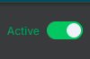
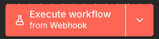

## Pré-requisitos

Antes de começar, certifique-se de que você tem as seguintes ferramentas instaladas na sua máquina:

* [Node.js](https://nodejs.org/en/) (versão 18.x ou superior)
* [npm](https://www.npmjs.com/) (geralmente instalado com o Node.js)
* [Docker](https://www.docker.com/products/docker-desktop/)
* [Docker Compose](https://docs.docker.com/compose/install/)

## Instalação e configuração

Clone o repositório `git clone [https://github.com/Bucaneiradill/desafio-recruta-onfly.git`

Instale o nó e execute localmente

```

npm install
npm run build
docker compose up -d
```

## Configure o nó

Acesse o n8n com a url **http://localhost:5678** preencha o formulário

Crie um novo workflow em branco no simbolo de `+`

vai nos 3 pontinho `...` -> import from file -> e envie [este documento ](https://drive.google.com/file/d/1_PxKti5f7toQwEhLwPwbtOs3k2NtgMVj/view?usp=sharing)

e mantenha ativo



## Execute o serviço!

clique em execute workflow



e use o link `http://localhost:5678/webhook-test/4acb9b09-5651-4ff1-ac32-f18084315c6c` em outra aba do navegador

e pronto, seu número aleatório foi gerado!

este botão de Execute workflow, deve ser ativado a cada requisição que realizar.
